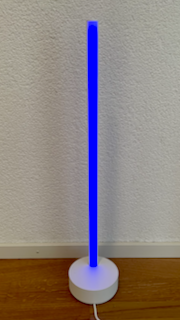
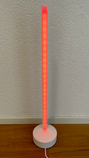
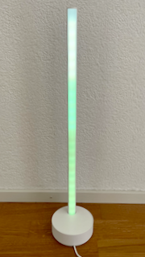
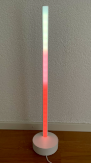
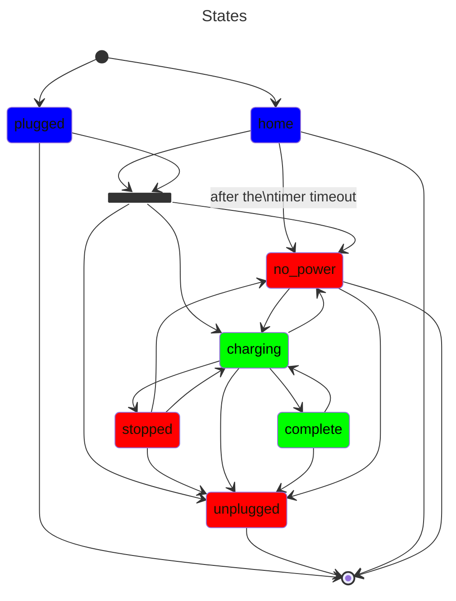

# Tesla Charging Status

This project notifies anyone at home whether the car is charging or not. I created this project for personal use because sometimes we would leave home with an almost empty battery; either the car wasn’t plugged in or the charge hadn’t started.

*We don’t have* a Tesla charger at home; we use a Zaptec charger. Even if the cable is plugged in, the car won’t charge unless the charging process is started, otherwise, the light will stay red.

## Pre-requisites

This application is listening to the events emited by [Teslamate](https://github.com/teslamate-org/teslamate) on a MQTT server reachable and support only a [Philips Hue Signe Gradient Lamp](https://www.philips-hue.com/en-us/p/hue-white-and-color-ambiance-signe-gradient-floor-lamp/046677803513) to display the battery status.

## The color states

| Status                                               | Preview                 |
| ---------------------------------------------------- | ----------------------- |
| Home geofence triggered                              |  |
| No poweer, not plugged in, not charged, nor stopped. |   | s |
| Charging                                             |   |
| Charged (with battery level)                         |   |
| Stopped (with battery level)                         |    |

## Docker

I strongly suggest to use Docker to run the application but you can clone the project and run it manually.

```yaml
version: '3'
services:
  prod:
    build:
      context: .
      dockerfile: Dockerfile
    image: minidfx/teslamate-charging-status:0.8.1
    environment:
      - MQTT_HOST=<host>
      - MQTT_PORT=<port>
      - MQTT_USERNAME=<username>
      - MQTT_PASSWORD=<password>
      - HUE_BRIDGE_HOST=<host>
      - HUE_BRIDGE_APPLICATION_KEY=<key>
      - HUE_LIGHT_ID=<id>
      - CAR_ID=<id>
      - GEOFENCE_HOME_NAME=<name>
```

| Variable                   | Description                                                                                                                                                                                |
| -------------------------- | ------------------------------------------------------------------------------------------------------------------------------------------------------------------------------------------ |
| MQTT_HOST                  | The IP address or the FQDN of the MQTT server.                                                                                                                                             |
| MQTT_PORT                  | The port of the MQTT server, default is 1883.                                                                                                                                              |
| MQTT_USERNAME              | The username of your MQTT broker (optional)                                                                                                                                                |
| MQTT_PASSWORD              | The password of your MQTT broker (optional)                                                                                                                                                |
| HUE_BRIDGE_HOST            | The IP address or the FQDN of the [hue bridge](https://www.philips-hue.com/en-us/p/hue-bridge/046677458478).                                                                               |
| HUE_BRIDGE_APPLICATION_KEY | The key generated by your bridge to access to the API, please read [the getting started](https://developers.meethue.com/develop/hue-api-v2/getting-started/) article if you don't have it. |
| HUE_LIGHT_ID               | The identifier of hue gradient signe. Get the identifier of your light by [calling the API](https://developers.meethue.com/develop/hue-api-v2/getting-started/#retrieving-device-list).    |
| CAR_ID                     | The identifier of your car connected to [Teslamate](https://github.com/teslamate-org/teslamate), very often is 1.                                                                          |
| GEOFENCE_HOME_NAME         | The name of the geofence representing your Home.                                                                                                                                           |

### Tips

With the given **docker-compose.yml** file, you can pull and run the image from [Docker](https://hub.docker.com) hub by typing the following command:

> docker-compose up [-d]

or you can build the image on your server by typing the following command:

> docker-compose build

## States machine

The states handled by the application to determine the charging status of the car.


