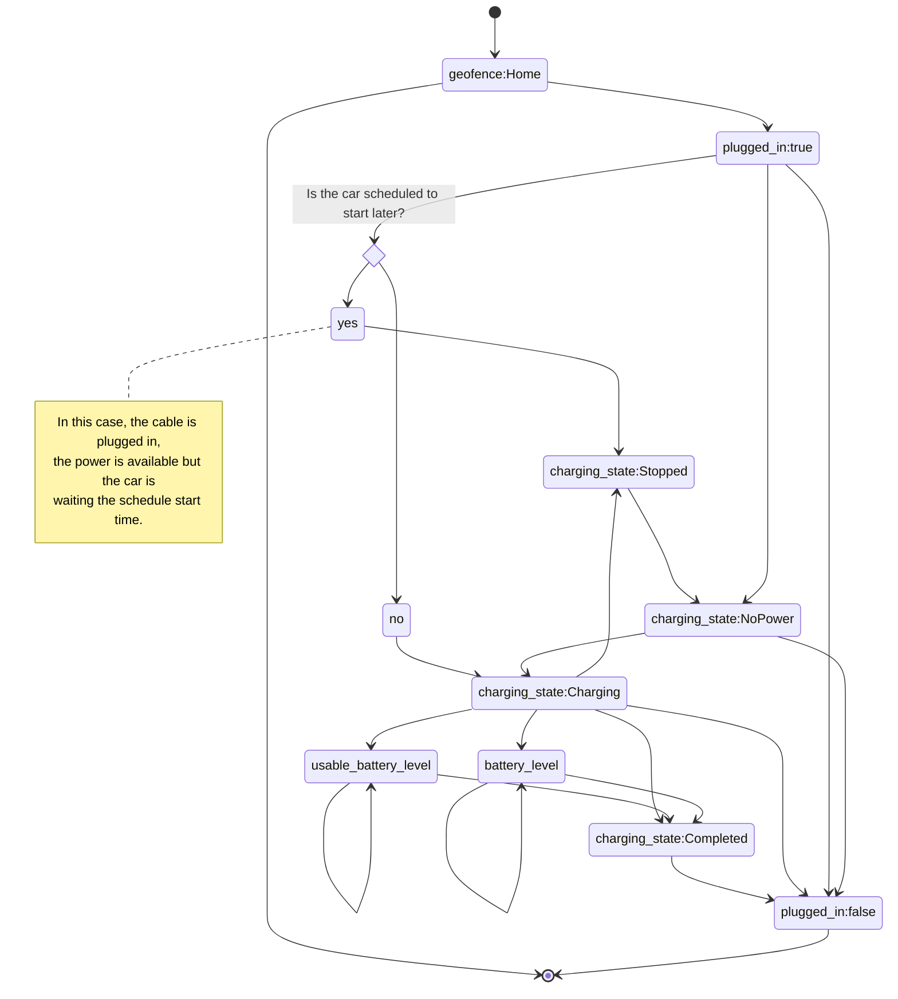

# Hue Philips Signe Gradient

TODO

## Docker

TODO

## States

```mermaid
stateDiagram-v2

  state "geofence:Home" as Geofenced
  state "charging_state:Charging" as Charging
  state "charging_state:Completed" as Completed
  state "charging_state:Stopped" as Stopped
  state "charging_state:NoPower" as NoPower
  state "plugged_in:true" as Plugged
  state "plugged_in:false" as Unplugged

  state IsScheduled <<choice>>

  [*] --> Geofenced
  Geofenced --> Plugged

  Plugged --> IsScheduled: Is the car scheduled to start later?
  IsScheduled --> yes
  IsScheduled --> no

  note right of yes
    In this case, the cable is plugged in,
    the power is available but the car is
    waiting the schedule start time.
  end note

  yes --> Stopped
  no --> Charging

  Charging --> Completed
  Charging --> Stopped

  NoPower --> Charging

  Completed --> Unplugged
  Charging --> Unplugged
  Plugged --> Unplugged
  NoPower --> Unplugged

  Charging --> usable_battery_level
  Charging --> battery_level

  usable_battery_level --> usable_battery_level
  usable_battery_level --> Completed

  battery_level --> battery_level
  battery_level --> Completed

  Stopped --> NoPower
  Plugged --> NoPower

  Geofenced --> [*]
  Unplugged --> [*]
```